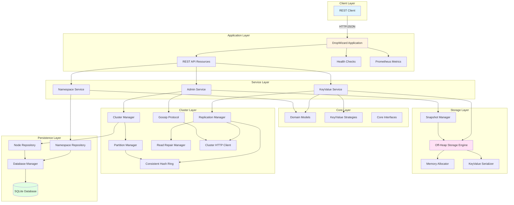

# System Architecture Overview

## High-Level Architecture

This document describes the overall architecture of the Distributed Key-Value Store system.

## Key Components

### Application Layer
- **DropWizard Application**: Main application entry point, manages lifecycle
- **REST API Resources**: Endpoint handlers for namespaces, key-values, and admin operations
- **Health Checks**: Application health monitoring
- **Prometheus Metrics**: Performance and operational metrics

### Service Layer
- **KeyValue Service**: Business logic for key-value operations
- **Namespace Service**: Namespace management and configuration
- **Admin Service**: Cluster administration and maintenance

### Core Layer
- **Domain Models**: Namespace, KeyValue, Node, ConsistencyLevel
- **Strategies**: Pluggable key and value strategies (HASH, STRING, JSON_BLOB, ATOMIC_INCREMENT)
- **Interfaces**: Core abstractions for storage, clustering, and replication

### Storage Layer
- **Off-Heap Storage Engine**: DirectByteBuffer-based native memory storage
- **Memory Allocator**: Manages 256MB memory chunks
- **KeyValue Serializer**: Efficient binary serialization
- **Snapshot Manager**: GZIP-compressed snapshots for disaster recovery

### Cluster Layer
- **Cluster Manager**: Node discovery and membership
- **Replication Manager**: Data replication across nodes with configurable consistency
- **Partition Manager**: Data distribution using consistent hashing
- **Consistent Hash Ring**: Virtual nodes for even distribution (150 per node)
- **Gossip Protocol**: Anti-entropy with 5s intervals, fanout of 3
- **Read Repair Manager**: Version-based consistency repair
- **HTTP Client**: Java 11+ HttpClient for inter-node communication

### Persistence Layer
- **Database Manager**: JDBI-based database lifecycle management
- **Repositories**: CRUD operations for namespaces and nodes
- **SQLite**: Embedded database for metadata storage

## Data Flow

### Write Path
1. Client sends PUT request to REST API
2. KeyValue Service validates namespace and applies value strategy
3. Replication Manager determines target nodes via consistent hashing
4. Data written to local off-heap storage
5. Replication Manager replicates to N-1 nodes based on replication factor
6. Response returned when consistency level achieved (ONE/QUORUM/ALL)

### Read Path
1. Client sends GET request to REST API
2. KeyValue Service queries local off-heap storage
3. If read repair enabled, queries multiple replicas
4. Read Repair Manager resolves conflicts based on version
5. Data returned to client

### Cluster Communication
1. Gossip Protocol runs every 5 seconds
2. Each node selects 3 random peers (fanout)
3. Exchanges node status and data checksums
4. Triggers read repair if inconsistencies detected
