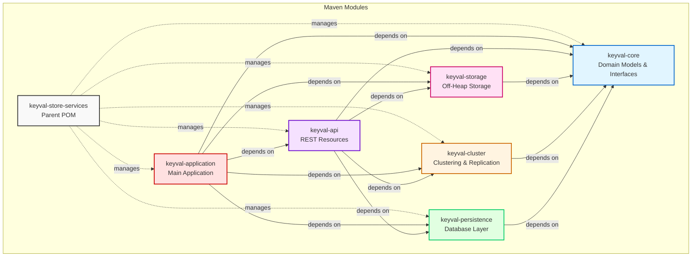

# Module Dependencies

## Maven Multi-Module Structure

This diagram shows the dependency relationships between all Maven modules in the project.

## Module Descriptions

### keyval-core
**Purpose**: Foundation module containing domain models, core interfaces, and strategies.

**Key Components**:
- Domain Models: `Namespace`, `KeyValue`, `Node`, `ConsistencyLevel`
- Interfaces: `StorageEngine`, `ClusterManager`, `ReplicationManager`, `PartitionManager`
- Strategies: `KeyStrategy` (HASH), `ValueStrategy` (STRING, ATOMIC_INCREMENT, JSON_BLOB)
- Exceptions: Custom exception hierarchy

**Dependencies**: None (foundation module)

**Package**: `com.constelld.keyvalstore.core`

### keyval-storage
**Purpose**: Off-heap storage implementation using DirectByteBuffer.

**Key Components**:
- `OffHeapStorageEngine`: Main storage implementation
- `MemoryAllocator`: Manages 256MB chunks of native memory
- `KeyValueSerializer`: Binary serialization/deserialization
- `SnapshotManager`: GZIP-compressed snapshot creation and loading

**Dependencies**:
- `keyval-core` (implements `StorageEngine` interface)

**Package**: `com.constelld.keyvalstore.storage`

### keyval-cluster
**Purpose**: Distributed clustering, replication, and partitioning.

**Key Components**:
- `DefaultClusterManager`: Node membership management
- `DefaultReplicationManager`: Data replication with consistency levels
- `ConsistentHashRing`: Virtual node-based partitioning (150 vnodes/node)
- `GossipProtocol`: Anti-entropy gossip (5s interval, fanout 3)
- `ReadRepairManager`: Version-based conflict resolution
- `ClusterHttpClient`: HTTP-based inter-node communication

**Dependencies**:
- `keyval-core` (implements cluster interfaces)

**Package**: `com.constelld.keyvalstore.cluster`

### keyval-persistence
**Purpose**: SQLite-based metadata persistence using JDBI.

**Key Components**:
- `DatabaseManager`: Database lifecycle and connection management
- `NamespaceRepository`: Namespace CRUD with JSON serialization
- `NodeRepository`: Node metadata persistence
- Flyway migrations: Schema versioning

**Dependencies**:
- `keyval-core` (persists domain models)

**Package**: `com.constelld.keyvalstore.persistence`

### keyval-api
**Purpose**: REST API resources, DTOs, health checks, and metrics.

**Key Components**:
- `KeyValueResource`: CRUD operations on key-value pairs
- `NamespaceResource`: Namespace management endpoints
- `AdminResource`: Cluster administration (gossip, snapshots)
- `PrometheusMetricsResource`: Metrics endpoint
- DTOs: Request/Response models
- `StorageHealthCheck`: Health monitoring

**Dependencies**:
- `keyval-core` (uses domain models)
- `keyval-storage` (interacts with storage)
- `keyval-cluster` (cluster operations)
- `keyval-persistence` (data persistence)

**Package**: `com.constelld.keyvalstore.api`

### keyval-application
**Purpose**: Main DropWizard application and integration point.

**Key Components**:
- `KeyValStoreApplication`: Main entry point
- `KeyValStoreConfiguration`: Configuration binding
- Configuration files: `config.yml`, `config-node*.yml`
- Logback configuration
- Integration tests

**Dependencies**: All other modules (assembles the complete application)

**Package**: `com.constelld.keyvalstore.application`

## Dependency Management

The parent POM (`keyval-store-services`) manages:

- **Dependency Versions**: DropWizard BOM 4.0.8, Java 21
- **Plugin Configuration**: Maven Compiler, Surefire, Shade
- **Common Dependencies**: JUnit Jupiter, Mockito, SLF4J
- **Build Properties**: Encoding (UTF-8), Java version (21)

## Build Order

Maven builds modules in dependency order:

1. `keyval-core` (no dependencies)
2. `keyval-storage`, `keyval-cluster`, `keyval-persistence` (depend on core)
3. `keyval-api` (depends on all lower layers)
4. `keyval-application` (depends on all modules)

## Testing Strategy

Each module has its own test scope:

- **Unit Tests**: Within each module's `src/test/java`
- **Integration Tests**: In `keyval-application` module
- **Test Isolation**: Each module can be tested independently
