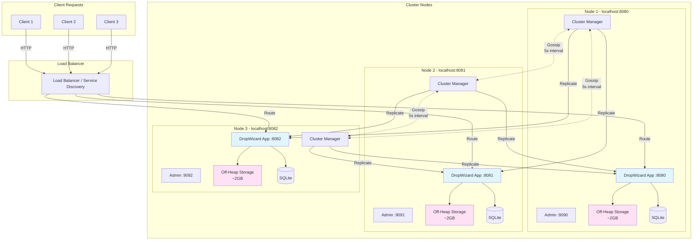
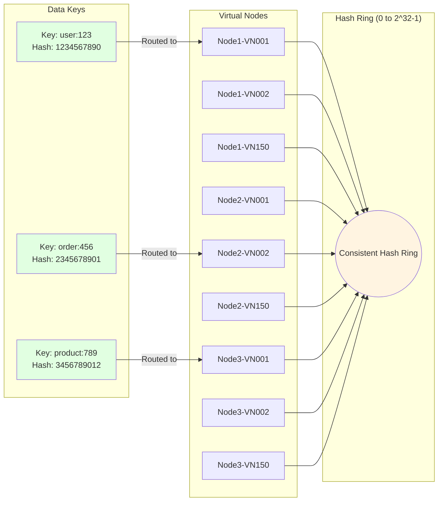
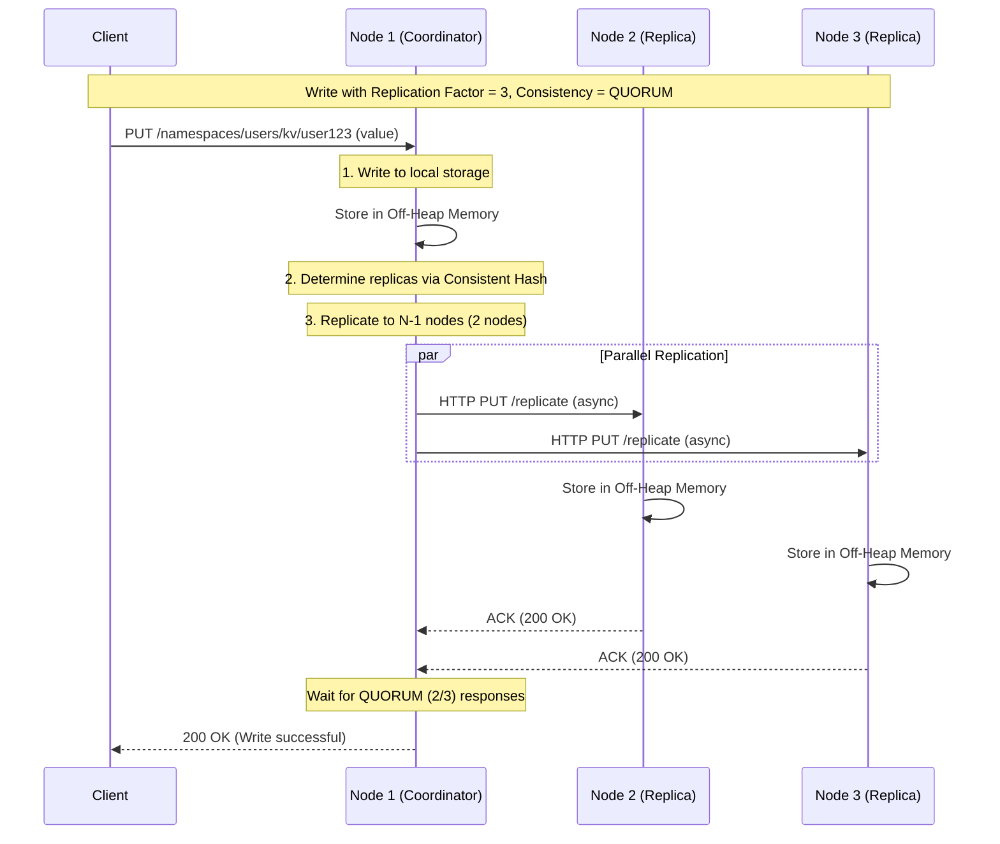
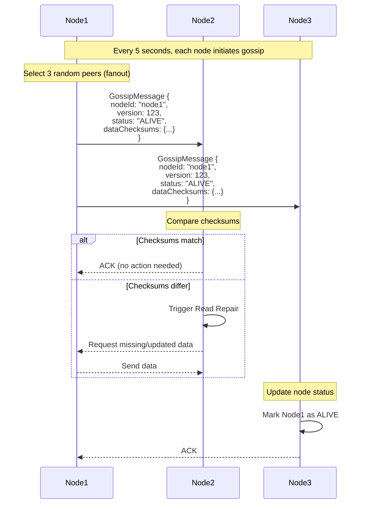
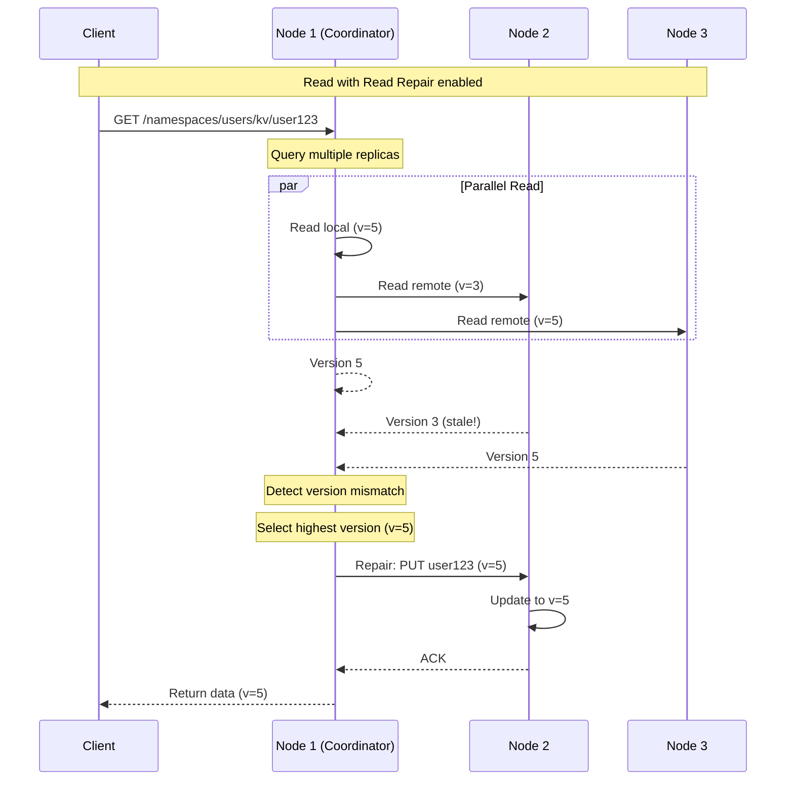
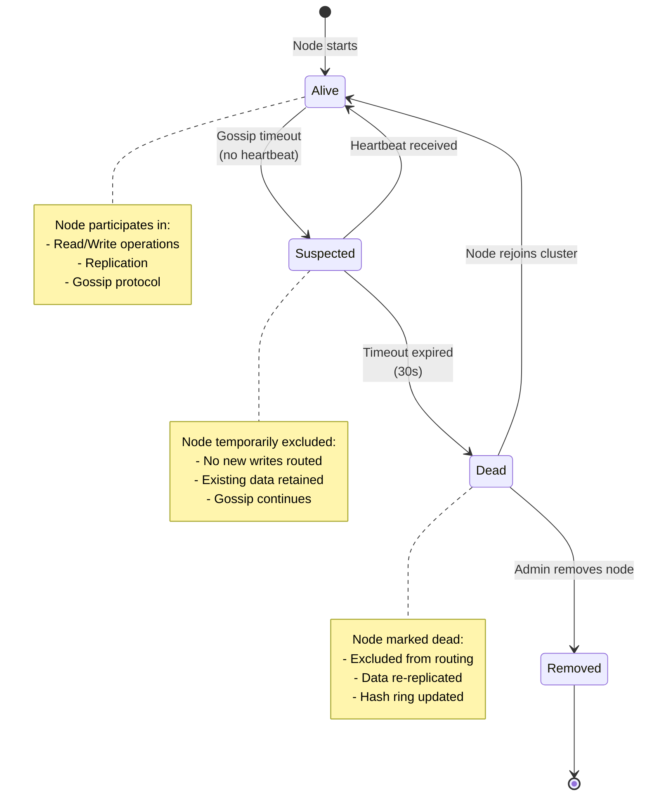

# Cluster Architecture

## Multi-Node Cluster Topology

This diagram shows how multiple nodes form a distributed cluster.

## Consistent Hashing and Data Distribution

## Replication Strategy

## Gossip Protocol Flow

## Read Repair Mechanism

## Node Failure and Recovery

## Configuration Parameters

### Cluster Settings

| Parameter | Default | Description |
|-----------|---------|-------------|
| `replicationFactor` | 3 | Number of replicas per key |
| `virtualNodesPerNode` | 150 | Virtual nodes for consistent hashing |
| `seedNodes` | [] | Initial nodes to join |
| `gossipInterval` | 5000ms | Gossip protocol interval |
| `gossipFanout` | 3 | Number of peers per gossip round |

### Consistency Levels

| Level | Reads | Writes | Description |
|-------|-------|--------|-------------|
| `ONE` | 1 node | 1 node | Fastest, lowest consistency |
| `QUORUM` | N/2+1 nodes | N/2+1 nodes | Balance of speed and consistency |
| `ALL` | N nodes | N nodes | Slowest, highest consistency |

### Port Assignments

| Node | Application Port | Admin Port |
|------|-----------------|------------|
| Node 1 | 8080 | 9090 |
| Node 2 | 8081 | 9091 |
| Node 3 | 8082 | 9092 |
