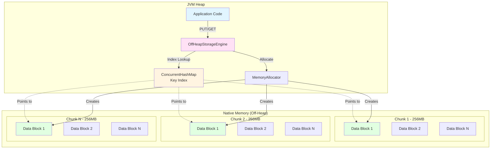
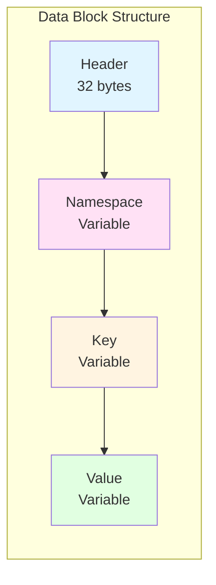
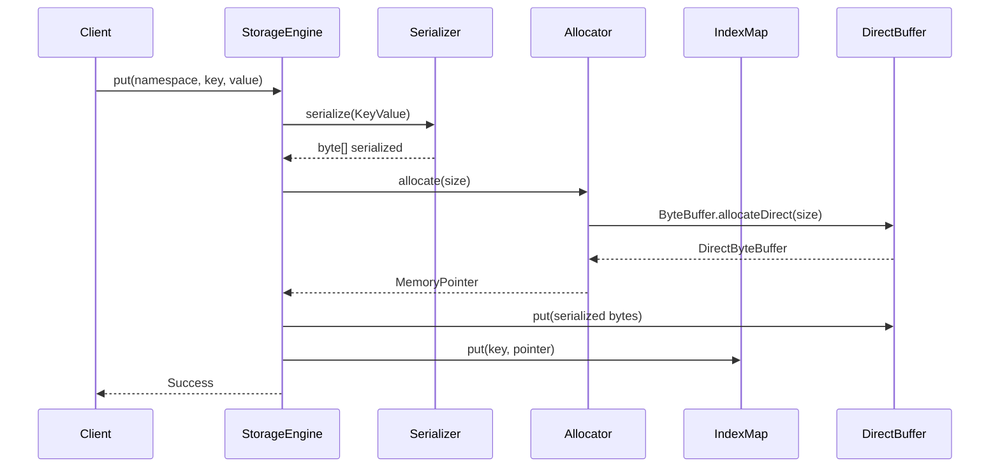
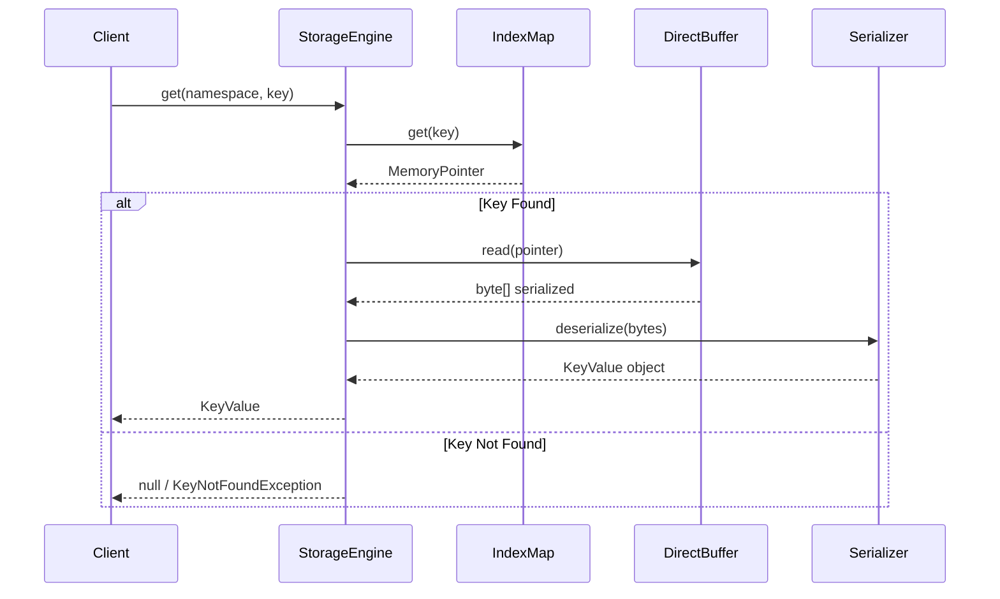
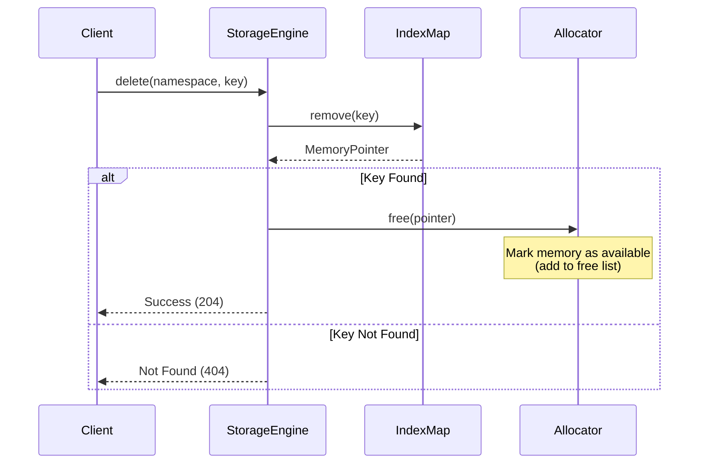
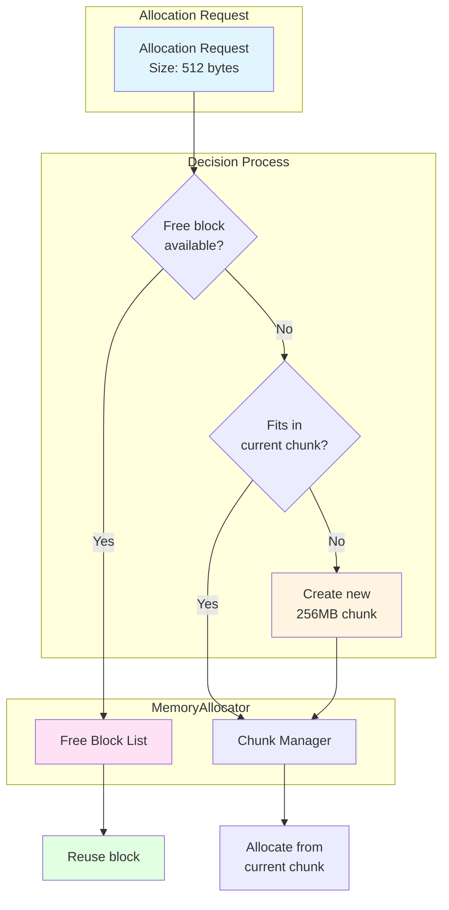
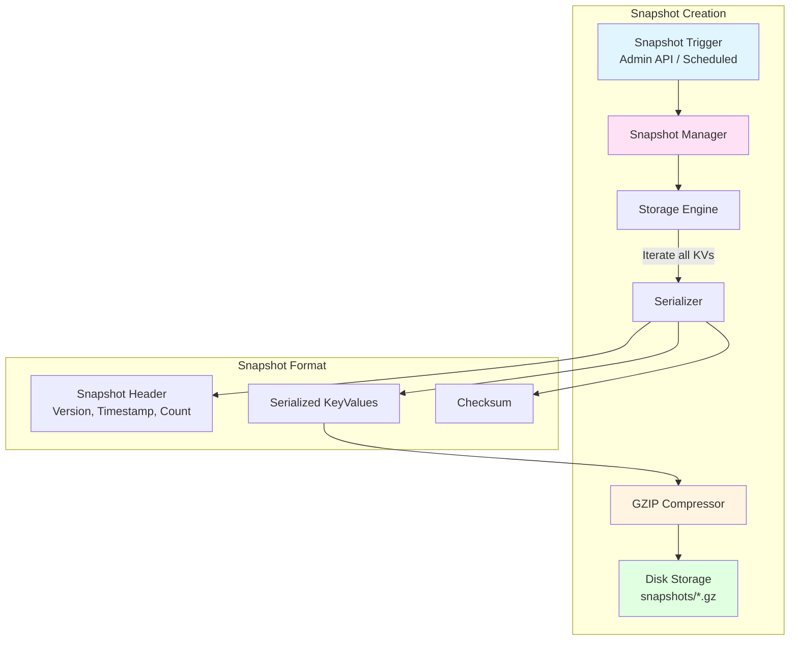
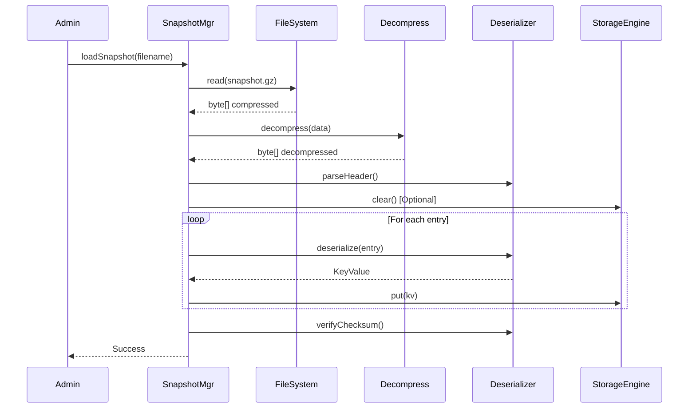
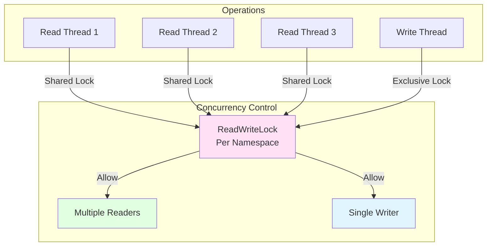

# Storage Architecture

## Off-Heap Memory Management

This diagram shows how the storage engine manages native memory outside the JVM heap.



## Data Block Structure

Each data block in off-heap memory has the following binary layout:



### Header Format (32 bytes)

| Offset | Size | Field | Description |
|--------|------|-------|-------------|
| 0 | 4 bytes | Namespace Length | Length of namespace string |
| 4 | 4 bytes | Key Length | Length of key string |
| 8 | 4 bytes | Value Length | Length of value data |
| 12 | 8 bytes | Version | Version number for conflict resolution |
| 20 | 8 bytes | Timestamp | Unix timestamp (milliseconds) |
| 28 | 4 bytes | Checksum | CRC32 checksum (optional) |

## Storage Operations

### Write (PUT) Operation



### Read (GET) Operation



### Delete Operation



## Memory Allocation Strategy



## Snapshot Architecture



### Snapshot File Structure

```
snapshots/
├── snapshot-2025-01-19T10-30-00.gz
├── snapshot-2025-01-19T11-00-00.gz
└── snapshot-2025-01-19T11-30-00.gz
```

Each snapshot contains:
1. **Header**: Version (4 bytes), Timestamp (8 bytes), Entry Count (4 bytes)
2. **Data Blocks**: Serialized KeyValue objects (one per entry)
3. **Footer**: SHA-256 checksum (32 bytes)

## Snapshot Restore Flow



## Memory Management Best Practices

### Advantages of Off-Heap Storage

1. **No GC Pressure**: Data stored outside JVM heap doesn't trigger garbage collection
2. **Large Capacity**: Not limited by JVM heap size (`-Xmx`)
3. **Predictable Performance**: No GC pause times
4. **Process Survival**: Data persists across JVM restarts (with snapshots)

### Trade-offs

1. **Manual Management**: Must explicitly free memory
2. **Serialization Overhead**: Convert objects to/from byte arrays
3. **No Type Safety**: Raw byte buffers require careful handling
4. **Limited by System RAM**: Total memory constrained by physical RAM

### Configuration

```yaml
storage:
  maxOffHeapMemory: 2GB  # Maximum native memory to use
  chunkSize: 256MB       # Size of each DirectByteBuffer chunk
  enableSnapshots: true   # Enable snapshot functionality
  snapshotDirectory: ./snapshots
```

## Concurrent Access



### Lock Granularity

- **Namespace-level locks**: Each namespace has its own ReadWriteLock
- **Read operations**: Multiple concurrent readers allowed
- **Write operations**: Exclusive access, blocks all readers and other writers
- **Lock-free index**: ConcurrentHashMap for key-to-pointer mapping

## Performance Characteristics

| Operation | Time Complexity | Concurrency |
|-----------|----------------|-------------|
| PUT | O(1) average | Write lock required |
| GET | O(1) average | Read lock (shared) |
| DELETE | O(1) average | Write lock required |
| LIST | O(n) | Read lock (shared) |
| Snapshot Create | O(n) | Read lock (shared) |
| Snapshot Load | O(n) | Write lock required |

Where n = number of entries in the namespace.
