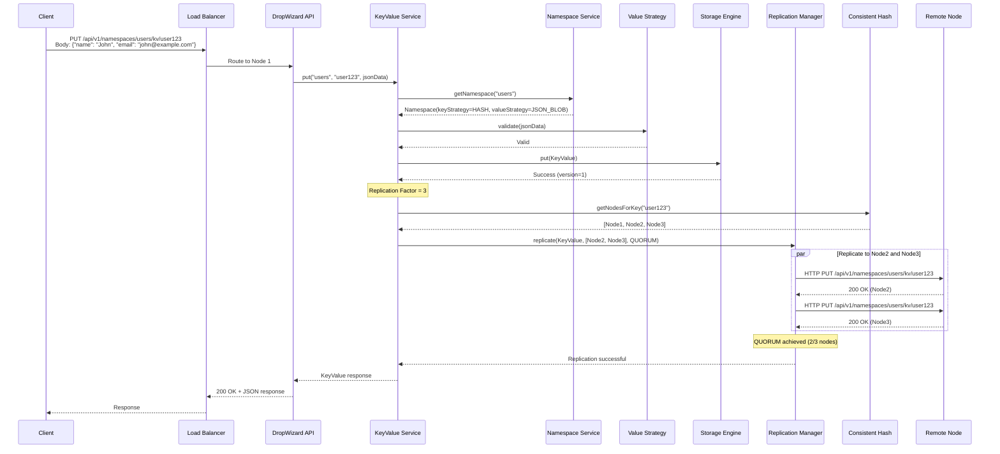
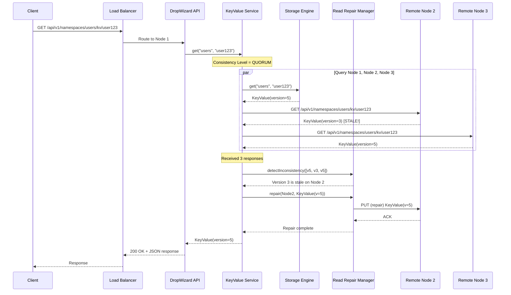
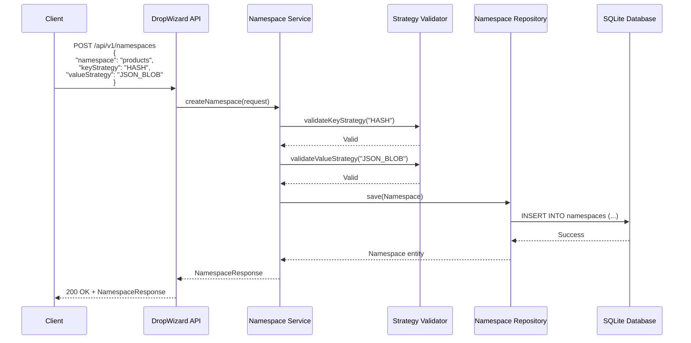
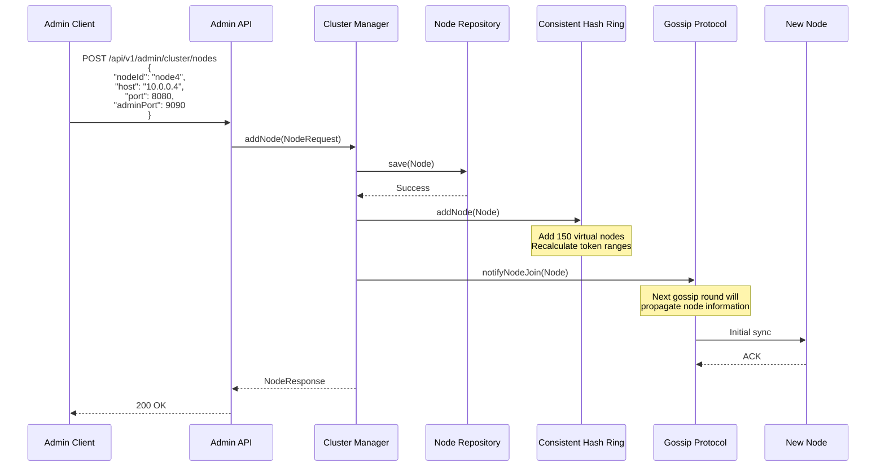
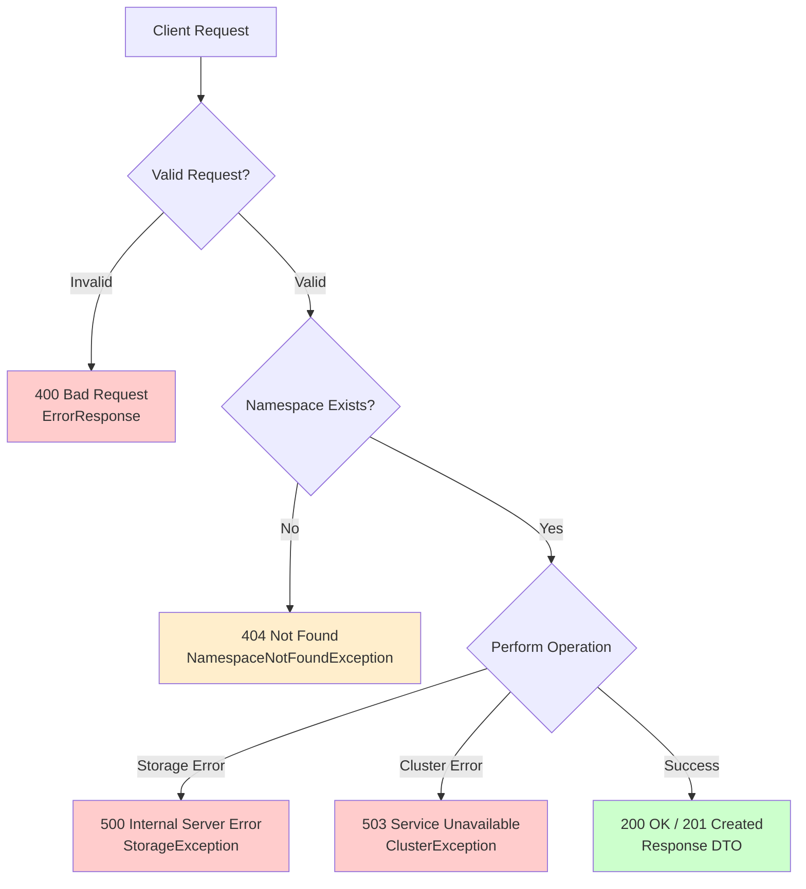

# API and Data Flow

## REST API Endpoints

```mermaid
graph TB
    subgraph "Client Applications"
        WebApp[Web Application]
        Mobile[Mobile App]
        Service[Microservice]
    end

    subgraph "Load Balancer"
        LB[Load Balancer<br/>:80 or :443]
    end

    subgraph "API Endpoints - Port 8080"
        subgraph "Namespace API"
            NS_POST[POST /api/v1/namespaces<br/>Create Namespace]
            NS_GET[GET /api/v1/namespaces<br/>List Namespaces]
            NS_GET_ONE[GET /api/v1/namespaces/:name<br/>Get Namespace]
            NS_DELETE[DELETE /api/v1/namespaces/:name<br/>Delete Namespace]
        end

        subgraph "Key-Value API"
            KV_PUT[PUT /api/v1/namespaces/:ns/kv/:key<br/>Store Value]
            KV_GET[GET /api/v1/namespaces/:ns/kv/:key<br/>Retrieve Value]
            KV_DELETE[DELETE /api/v1/namespaces/:ns/kv/:key<br/>Delete Value]
            KV_LIST[GET /api/v1/namespaces/:ns/kv<br/>List Keys]
        end

        subgraph "Admin API"
            ADMIN_NODES[GET/POST/DELETE /api/v1/admin/cluster/nodes<br/>Node Management]
            ADMIN_STATUS[GET /api/v1/admin/cluster/status<br/>Cluster Status]
            ADMIN_GOSSIP[POST /api/v1/admin/cluster/gossip<br/>Trigger Gossip]
            ADMIN_SNAPSHOT[POST /api/v1/admin/snapshot/create<br/>Create Snapshot]
            ADMIN_SNAP_LIST[GET /api/v1/admin/snapshot/list<br/>List Snapshots]
            ADMIN_SNAP_LOAD[POST /api/v1/admin/snapshot/load<br/>Load Snapshot]
            ADMIN_METRICS[GET /api/v1/admin/metrics<br/>Prometheus Metrics]
        end
    end

    subgraph "Health & Monitoring - Port 9090"
        HEALTH[GET /healthcheck<br/>Application Health]
        ADMIN_TASKS[GET /tasks<br/>Admin Tasks]
        ADMIN_THREADS[GET /threads<br/>Thread Dump]
    end

    WebApp --> LB
    Mobile --> LB
    Service --> LB

    LB --> NS_POST
    LB --> KV_PUT
    LB --> ADMIN_NODES

    style NS_POST fill:#e1f5ff
    style KV_PUT fill:#ffe1f5
    style ADMIN_NODES fill:#fff4e1
    style HEALTH fill:#e1ffe1
```



## Complete Request Flow - Write Operation



## Complete Request Flow - Read Operation



## Namespace Creation Flow



## Admin - Cluster Node Addition



## Error Handling Flow



## API Error Responses

All error responses follow this format:

```json
{
  "code": 404,
  "message": "Namespace not found: users",
  "details": "The requested namespace 'users' does not exist. Create it first using POST /api/v1/namespaces",
  "timestamp": "2025-01-19T10:30:00.000Z"
}
```

### HTTP Status Codes

| Code | Meaning | When Used |
|------|---------|-----------|
| 200 | OK | Successful GET, PUT operations |
| 201 | Created | Successful POST (namespace creation) |
| 204 | No Content | Successful DELETE operations |
| 400 | Bad Request | Invalid input, malformed JSON, invalid strategy |
| 404 | Not Found | Namespace or key doesn't exist |
| 409 | Conflict | Namespace already exists |
| 500 | Internal Server Error | Storage engine failure, unexpected errors |
| 503 | Service Unavailable | Cluster unavailable, replication failure |

## Prometheus Metrics

Exposed at `/api/v1/admin/metrics` in Prometheus text format:

```
# HELP keyval_requests_total Total number of requests
# TYPE keyval_requests_total counter
keyval_requests_total{endpoint="put",namespace="users"} 12345

# HELP keyval_request_duration_seconds Request duration in seconds
# TYPE keyval_request_duration_seconds histogram
keyval_request_duration_seconds_bucket{endpoint="get",le="0.01"} 1000
keyval_request_duration_seconds_bucket{endpoint="get",le="0.05"} 2500

# HELP keyval_storage_used_bytes Storage used in bytes
# TYPE keyval_storage_used_bytes gauge
keyval_storage_used_bytes{namespace="users"} 1048576

# HELP keyval_replication_lag_seconds Replication lag in seconds
# TYPE keyval_replication_lag_seconds gauge
keyval_replication_lag_seconds{source_node="node1",target_node="node2"} 0.05
```

## Health Check Response

```json
{
  "storage": {
    "healthy": true,
    "message": "Off-heap storage operational",
    "usedMemory": "512MB",
    "maxMemory": "2GB"
  },
  "cluster": {
    "healthy": true,
    "message": "Cluster operational",
    "activeNodes": 3,
    "totalNodes": 3
  },
  "database": {
    "healthy": true,
    "message": "Database connected"
  },
  "deadlocks": {
    "healthy": true
  }
}
```
